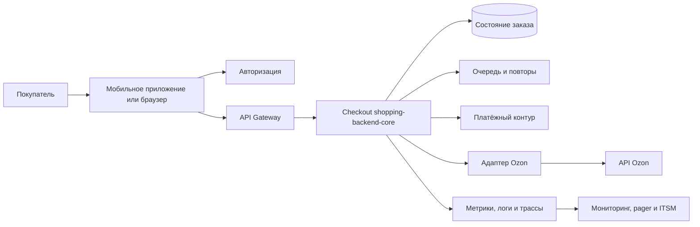

# Практическая работа №2. Регламент управления ИТ-сервисом checkout Т‑Шопинга

**Курс:** Управление информационными технологиями на предприятии (ITIL)  
**Семестр:** осень/зима 2026  
**Объект:** checkout-часть `shopping-backend-core`  
**Версия регламента:** 1.0  
**Дата:** 6 октября 2026 года  
**Статус:** учебный проект, не внутренний документ Т‑Банка

## Краткий паспорт проекта

| Параметр | Краткое описание |
| --- | --- |
| Компания и продукт | Т‑Банк, раздел «Шопинг» в мобильном приложении и браузерном канале. |
| ИТ-сервис | Checkout-часть `shopping-backend-core`: приём запроса на оформление, фиксация состояния, идемпотентная операция, интеграция с партнёром и возврат результата. Каталог, рекомендации, платёж и доставка не входят в предмет сервиса. |
| Пользователи и нагрузка | Покупатели; смежные команды и поддержка. Ориентир всего ядра — 2,5 тыс. RPS устойчиво, проверочный пик — 10 тыс. RPS на 30 минут; учебная модель checkout — около 21 тыс. попыток в сутки. |
| Критичность | Выручкообразующий сервис T0. Учебная оценка невосстановленной комиссии при часовом простое — около 66 тыс. ₽ в среднем и до 263 тыс. ₽ в модельный пик. |
| Режим и SLA | 24×7, МСК; доступность собственного checkout ≥99,95% за месяц; P1: реакция ≤10 минут, восстановление ≤2 часов; подтверждённые заказы не теряются. |

Исходные сведения и допущения приведены в [паспорте проекта](./passport-t-shopping.md). Числа нагрузки и финансового влияния являются учебными, если прямо не указано иное.

## 1. Назначение, область действия и нормативная база

Регламент определяет, какие действия и какие роли обеспечивают выполнение [SLA checkout Т‑Шопинга](./sla-shopping-backend-core-checkout.md). Он применяется к продуктивному checkout, связанным обращениям, изменениям, мониторингу, проблемам, мощности и поставщикам.

### 1.1. Какая редакция SLA действует

Для учебного сценария устанавливается единый источник нормативных требований:

- с **00:00 МСК 1 октября 2026 года** действует **редакция 2 SLA от 28 сентября 2026 года**;
- первоначальная редакция от 21 сентября 2026 года с этого момента считается заменённой;
- редакция, дата начала действия, согласующие лица и ссылка на неизменяемую копию хранятся в реестре соглашений;
- требования редакции 2 нельзя применять к событиям до даты её вступления в силу;
- приобретённые сервисы не включаются в этот SLA автоматически: до приёмки для них действуют унаследованные соглашения или отдельное Transition-приложение.

Это учебное решение устраняет долг сценария «Какая редакция действует?». В реальной организации дата должна подтверждаться подписанным решением сторон.

### 1.2. Условия сценария

Регламент учитывает одновременное действие событий «Лебедь 19», «Лебедь 22» и результат «Торг удался» по событию 47:

- бюджет сокращён примерно на треть, но SLA текущего checkout не ослаблен;
- приобретённый бизнес обслуживается в режиме Transition, а его численные показатели не смешиваются с checkout;
- три носителя знаний приобретённого стека ушли; авария унаследованного платёжного шлюза длилась 6 часов при целевом восстановлении 4 часа;
- вендор согласовал ограниченный PoC, фиксированную цену на два года и запрет публичного упоминания до получения результатов;
- инструмент PoC используется только для инвентаризации договоров и EOL/EOS и не включается в критический путь checkout.

### 1.3. Проверка операционной реализуемости SLA

Учебная команда включает одного SRE, поэтому один человек не может обеспечить устойчивое primary/secondary-покрытие 24×7. Значение реакции P1 ≤10 минут сохраняется при следующей операционной модели:

1. дежурную роль исполняет обученная ротация из SRE, технического лидера и трёх backend-инженеров;
2. на каждой смене назначаются разные primary и secondary;
3. для каждого T0-компонента подтверждаются минимум два компетентных исполнителя;
4. внешняя смена сохраняется до двух успешных учебных тревог во внерабочее время;
5. если модель не проходит учения, владелец сервиса запускает процедуру существенного изменения SLA, но не снижает цель односторонне.

При выполнении этих условий корректировка целевого времени P1 не требуется. При их невыполнении возникает документированный риск нарушения SLA и основание для решения о ресурсе, объёме услуги или целевом уровне.

## 2. Сервис и типы обращений

### 2.1. Граница сервиса

Зона ответственности поставщика начинается с приёма валидного запроса checkout контролируемым API. Она заканчивается возвратом клиенту однозначного результата с корреляционным идентификатором: подтверждённого заказа после долговременной фиксации либо явного отказа или состояния ожидания без ложного подтверждения и дубля.

Команда отвечает за бизнес-логику checkout, состояние заказа, идемпотентность, собственные очереди и повторы, интеграционный адаптер, журналирование и восстановление. Клиентское устройство, авторизация, исполнение платежа, ассортимент, API Ozon, доставка и возвраты находятся за границей сервиса. Ошибка собственного адаптера или неверная обработка внешнего ответа остаётся ответственностью команды checkout.

### 2.2. Правило классификации обращения

| Тип | Определяющий признак | Примеры |
| --- | --- | --- |
| Инцидент | Функция работала или должна была работать, но прервалась, замедлилась либо создаёт риск потери качества или данных. | 5xx, таймаут, рост p95, дубль заказа, недоступность Ozon, отказ мониторинга T0. |
| Запрос на обслуживание | Пользователь или сотрудник просит выполнить заранее определённое штатное действие по утверждённой инструкции. | Доступ к дашборду, подписка на уведомления, стандартный отчёт, тестовая учётная запись. |
| Запрос на изменение | Требуется изменить код, конфигурацию, инфраструктуру, интеграцию или правила работы сервиса. | Релиз, изменение таймаута, новая зависимость, обновление схемы данных, экстренный rollback. |

Если обращение одновременно содержит просьбу об изменении и сообщает о нарушении услуги, сначала создаётся инцидент. Изменение связывается с ним отдельной записью и проходит стандартную либо срочную процедуру Change Enablement.

### 2.3. Влияние и срочность инцидента

**Влияние:**

- **I1, критическое:** checkout массово недоступен; есть риск потери или дублирования подтверждённых заказов; затронут весь канал или существенная доля покупок.
- **I2, значительное:** часть покупок проходит, но ошибки ≥1% в течение 15 минут, полный E2E p95 >5 секунд либо недоступен значимый канал или регион.
- **I3, ограниченное:** затронута небольшая группа, маршрут или функция; существует безопасный обход.
- **I4, минимальное:** единичный дефект без влияния на подтверждённые заказы и без заметного влияния на покупки.

**Срочность:**

- **U1, немедленная:** ущерб продолжается, безопасного обхода нет, нарушается целостность данных или активна крупная кампания.
- **U2, высокая:** есть временный обход, но деградация расширяется либо обход нельзя сохранять дольше одной смены.
- **U3, обычная:** устойчивый обход существует, влияние локализовано, ближайшего критичного события нет.
- **U4, низкая:** исправление можно планировать без роста ущерба.

### 2.4. Матрица приоритетов

| Влияние \ Срочность | U1 | U2 | U3 | U4 |
| --- | --- | --- | --- | --- |
| I1 | P1 | P1 | P2 | P2 |
| I2 | P1 | P2 | P2 | P3 |
| I3 | P2 | P3 | P3 | P4 |
| I4 | P3 | P3 | P4 | P4 |

Матрица не может понизить явный критерий SLA. Риск потери или дублирования подтверждённого заказа, невозможность оформить заказ, ошибки >5% по правилу SLA либо отказ контрольных проб классифицируются как P1 независимо от предварительной оценки. При сомнении выбирается более высокий приоритет до появления доказательств.

### 2.5. Целевые сроки инцидентов

| Приоритет | Реакция | Восстановление или решение | Режим | Дополнительный результат |
| --- | --- | --- | --- | --- |
| P1 | ≤10 минут | ≤2 часов | 24×7 | Постоянное исправление и RCA ≤3 рабочих дней. |
| P2 | ≤30 минут | ≤8 часов | 24×7 | RCA ≤5 рабочих дней. |
| P3 | ≤4 рабочих часов | ≤3 рабочих дней | 09:00–18:00 МСК по рабочим дням РФ | Исправление или согласованный обход. |
| P4 | ≤1 рабочего дня | ≤10 рабочих дней | 09:00–18:00 МСК по рабочим дням РФ | Исправление, консультация или согласованный backlog. |

Для Transition-сервиса единая классификация P1–P4 применяется с первого дня, но время восстановления берётся из его наследованного SLA. Для платёжного шлюза приобретённой компании в сценарии действует наследованная цель 4 часа, пока отдельное приложение не изменит её.

### 2.6. Жизненный цикл инцидента

`New` → `Acknowledged` → `Diagnosing` → `Mitigating` → `Monitoring` → `Resolved` → `Closed`.

- `New`: запись создана мониторингом или Service Desk.
- `Acknowledged`: назначены владелец, приоритет и следующее действие. Только этот содержательный ответ останавливает таймер реакции.
- `Diagnosing`: собираются трассы, логи, метрики и сведения зависимостей.
- `Mitigating`: выполняется безопасный обход, rollback, переключение или load shedding.
- `Monitoring`: функция восстановлена и проверяется на стабильность.
- `Resolved`: восстановление подтверждено, но отчёт и проблема могут оставаться открытыми.
- `Closed`: заказные состояния сверены, коммуникации завершены, связанные записи созданы, а заказчик не оспорил восстановление.

P1 нельзя закрыть, пока checkout не стабилен минимум 30 минут, контрольные пробы успешны, риск дублей и потерь проверен, а временный обход имеет владельца и срок устранения.

### 2.7. Каталог запросов на обслуживание

Сроки ниже являются внутренними OLA-целями и не заменяют сроки инцидентов из SLA.

| Код | Запрос и критерий | Обязательные данные | Согласование | Срок | Автоматизация |
| --- | --- | --- | --- | --- | --- |
| SR-01 | Read-only доступ к дашборду SLA | ФИО/роль, подразделение, срок, руководитель | Владелец данных; AppSec для внешнего пользователя | 4 рабочих часа после согласования | Автовыдача по роли и автоотзыв по сроку. |
| SR-02 | Подписка на уведомления P1/P2 | Канал, роль, сервис, период | Руководитель смены | 4 рабочих часа | Полностью автоматически после подтверждения роли. |
| SR-03 | Стандартный месячный SLA-отчёт | Сервис и период | Не требуется для штатного получателя | До 5-го рабочего дня месяца | Сбор и публикация автоматически; исключения проверяет SLM. |
| SR-04 | Обезличенная техническая выборка | Цель анализа, период, поля, получатель | Владелец данных и AppSec | 2 рабочих дня | Автоматическая маскировка; выдача после согласования. |
| SR-05 | Тестовая учётная запись или безопасный synthetic-сценарий | Среда, срок, сценарий, владелец | QA и AppSec | 1 рабочий день | Создание и истечение учётной записи автоматически. |
| SR-06 | Консультация по статусу заказа для внутренней поддержки | Корреляционный идентификатор без ПДн | Не требуется | 4 рабочих часа | Автопоиск статуса; специалист разбирает только исключение. |
| SR-07 | Восстановление доступа к инструментам поддержки | Учётная запись, система, подтверждение руководителя | Владелец системы | 4 рабочих часа | Автоматически при стандартной роли. |

Запрос возвращается на уточнение, если отсутствуют обязательные данные. Таймер исполнения начинается после их получения; факт возврата и недостающие поля фиксируются в ITSM-системе.

### 2.8. Категории изменений

| Категория | Признак | Кто утверждает | Примеры |
| --- | --- | --- | --- |
| Стандартное | Повторяемое, низкорисковое, предодобренное, имеет проверенный runbook и rollback; не создаёт простоя. | Владелец стандартной модели; исполнитель проверяет условия. | Ротация секрета по утверждённой схеме, изменение порога некритичного алерта в допустимом диапазоне, плановое масштабирование в envelope. |
| Обычное | Не соответствует стандартной модели, меняет код, схему, зависимость, мощность или пользовательский путь. | Change Authority: техлид, SRE и владелец сервиса; AppSec подключается при влиянии на данные/безопасность. | Релиз checkout, новая версия API партнёра, изменение БД, подключение нового поставщика. |
| Срочное | Нужно для восстановления P1/P2 либо немедленного снижения критического риска безопасности. | Emergency Change Authority: Incident Manager + техлид + SRE; AppSec обязателен для security-изменения. | Rollback, feature flag, временное отключение T2/T3, срочное исправление уязвимости. |

Каждое изменение содержит риск, затронутые компоненты, план проверки, план отката, владельца, окно и критерий успеха. Плановый простой допускается только по правилам SLA: согласование заказчика, уведомление минимум за 7 календарных дней и не более 60 минут исключаемого времени в месяц. Срочное изменение проходит постпроверку не позднее следующего рабочего дня.

## 3. Окружение сервиса

### 3.1. Логическая схема

Схема логическая. Фактический стек checkout не раскрыт. Названия конкретных продуктов мониторинга, ITSM, БД и очереди в отчёте не утверждаются.

### 3.2. Точки передачи ответственности

| Граница | До границы отвечает checkout | После границы отвечает | Как доказывается причина | Риск разрыва |
| --- | --- | --- | --- | --- |
| Клиент → входной API | Приём валидного запроса и корреляционный ID | Клиентская команда, устройство и сеть | RUM, gateway-log, версия клиента | Клиент видит отказ, хотя backend не получил запрос. |
| Checkout → авторизация | Корректный вызов, таймаут и обработка ответа | Владелец IAM/авторизации | Distributed trace и код ответа | Нет OLA на ETA и логи. |
| Checkout → платёж | Идемпотентный запрос и безопасная обработка статуса | Платёжный контур | Trace, ключ идемпотентности, сверка | Неясный статус может породить повтор. |
| Checkout → Ozon | Адаптер, retry, timeout, circuit breaker и fallback | Ozon: наличие, партнёрский API и исполнение | Время вызова, код/таймаут, correlation ID | Внешний SLA не опубликован; исключение нельзя применять без доказательств. |
| Checkout → платёжный шлюз приобретённого бизнеса | Для checkout граница отсутствует до отдельной приёмки | Transition-владелец и поставщик шлюза | Отдельный журнал и наследованный SLA | Нельзя смешивать его 4-часовую цель с checkout. |
| Команда → инфраструктура | Конфигурация приложения и потребление ресурсов | Платформенная команда | Метрики CPU, памяти, очередей и событий платформы | Недостаточный резерв или неясный RACI. |

### 3.3. Каналы обращений и учёта

| Источник | Канал | Что создаётся | Источник истины |
| --- | --- | --- | --- |
| Автоматический мониторинг | Alert manager/pager | Инцидент при пороге P1/P2; событие при предупреждении | ITSM-запись с исходным alert ID. |
| Пользователь через поддержку | Service Desk/чат | Инцидент либо запрос на обслуживание | ITSM-тикет с обезличенным correlation ID. |
| Сотрудник или смежная команда | Портал ITSM/API | Инцидент, service request или change | Единая карточка обращения. |
| Поставщик | Выделенный supplier-канал | Связанная запись внешнего инцидента | Внутренний тикет; письмо поставщика является доказательством, но не заменяет запись. |
| AppSec/SOC | Защищённый канал | Security incident и связанный P1/P2 | Реестр безопасности + ссылка из ITSM. |

Чаты, телефон и конференц-мост используются для координации, но решения, время и доказательства переносятся в ITSM. Сообщение в чате без карточки не считается зарегистрированным обращением.

### 3.4. Мониторинг и данные

Контролируются:

- доля 5xx и таймаутов в пятиминутных интервалах;
- три независимые production-safe synthetic-пробы каждую минуту;
- p95 и p99 контролируемого серверного времени;
- E2E p95, успешность пользовательского пути и доля внешних отказов;
- RPS по маршрутам, глубина очередей, CPU, память и резерв T0;
- дубли, расхождения состояния, отставание сверки и результат backup/restore;
- доступность pager, наличие primary/secondary, EOL/EOS и состояние сертификатов;
- показатели приобретённых сервисов в отдельном Transition-дашборде.

Сроки хранения сырых логов определяются политикой безопасности. Месячные агрегаты и обезличенная выборка событий сохраняются для расчёта SLA и споров. Персональные данные, адреса, платёжные реквизиты и токены в отчёт не включаются.

### 3.5. Поставщики и обязательства

| Зависимость | Действующее обязательство в учебной модели | Операционный контроль |
| --- | --- | --- |
| Ozon | Точные договорные SLO не раскрыты. Отказ учитывается в E2E, а из кредитуемого checkout исключается только доказанная часть. | Trace, совместный incident channel, контакт и ETA в supporting contract. |
| Общебанковские IAM и платёж | Внутренние OLA должны поддерживать P1 checkout; точные фактические OLA неизвестны. | Сроки логов, эксперта и ETA; совместный P1-мост. |
| Платёжный шлюз приобретённой компании | Наследованное восстановление ≤4 часов до нового приложения. | Отдельный SLI, владелец Transition, расчёт кредита по наследованному договору. |
| Внешняя дежурная смена | Сохраняется до двух успешных внерабочих учений внутренней ротации. | Roster, результаты учений, запрет отключения без решения владельца риска. |
| Вендор PoC №47 | Ограниченный PoC, цена после пилота фиксирована на два года; публичное упоминание запрещено до результата. | Изолированный контур, проверяемый экспорт/выход, решение continue/stop до дня 90. |

## 4. Практики ITIL 4

Регламент использует обязательные шесть практик и две дополнительные. Capacity and Performance Management выбрана из-за целей 2,5/10 тыс. RPS и резерва T0 ≥20%. Supplier Management выбрана из-за зависимости от Ozon, внутренних владельцев, унаследованного шлюза, внешней смены и PoC.

### 4.1. Incident Management

Цель — быстро восстановить нормальную работу и уменьшить бизнес-влияние. Практика определяет матрицу P1–P4, единый жизненный цикл, маршрутизацию L1–L4, периодичность сообщений и критерии закрытия.

- L1 принимает и проверяет обращение.
- Primary on-call отвечает содержательно и начинает диагностику.
- L2 подключается к 25% времени восстановления: P1 — 30 минут, P2 — 2 часа.
- L3 подключается к 50%: P1 — 1 час, P2 — 4 часа.
- L4 подключается к 75%: P1 — 1 час 30 минут, P2 — 6 часов.
- После превышения цели P1 обновление публикуется каждые 30 минут, P2 — каждый час.

Восстановление не равно окончательному устранению причины. После восстановления инцидент связывается с проблемой, изменением, записью известной ошибки и кредитом, если они требуются.

### 4.2. Service Request Management

Практика обрабатывает только заранее определённые действия из каталога § 2.7. Владелец каталога ежемесячно проверяет объём, просрочки и долю автоматического исполнения. Новый повторяемый запрос сначала исполняется вручную по согласованной инструкции, затем получает модель согласования, срок и возможность автоматизации.

### 4.3. Change Enablement

Цель — увеличить долю успешных изменений через оценку риска, авторизацию и управление расписанием. Ни одно изменение не получает статус стандартного только из-за частоты выполнения. Предодобрение действует лишь при полном совпадении с моделью, включая границы параметров и rollback.

Обычные изменения проходят техническую, операционную и при необходимости security-проверку. Срочное изменение восстанавливает сервис или снижает критичный риск, но не используется для обхода планирования. Все изменения связываются с релизом, затронутыми конфигурационными единицами и измеримым результатом.

### 4.4. Problem Management

Проблема — причина одного или нескольких инцидентов либо риск их возникновения. Она не заменяет активный инцидент и может оставаться открытой после восстановления.

Проблема создаётся обязательно при:

- любом P1;
- повторении двух P2 одной сигнатуры за 30 дней;
- расходовании ≥50% error budget до середины месяца либо ≥75% в любой момент;
- неизвестной причине после восстановления;
- потере/дублировании подтверждённого заказа;
- нарушении внешним поставщиком или Transition-сервисом своего обязательства;
- обнаружении неподдерживаемого T0-компонента.

Для анализа используются временная шкала, «5 почему», проверка защитных барьеров и при необходимости fault tree. Известная ошибка содержит подтверждённую причину либо устойчиво воспроизводимый симптом, безопасный обход, владельца и срок устранения. KEDB доступна Service Desk и on-call.

### 4.5. Monitoring and Event Management

Практика систематически наблюдает за сервисом и преобразует значимые изменения состояния в события или инциденты.

| Сигнал | Класс | Автоматическое действие |
| --- | --- | --- |
| Ошибки >5% и минимум 2 технических отказа в пятиминутном интервале | Exception | Создать P1, вызвать primary/secondary. |
| 2 из 3 проб неуспешны в 3 из 5 минут | Exception | Создать P1. |
| Ошибки ≥1% в течение 15 минут | Exception | Создать P2. |
| E2E p95 >5 секунд в течение 15 минут | Exception | Создать P2. |
| Резерв T0 <20% устойчиво | Warning | Создать capacity-task; немедленно уведомить L3. |
| Error budget ≥50% до середины месяца или ≥75% в любое время | Warning | Запустить проактивную управленческую эскалацию. |
| Нет primary или secondary на смену | Exception | Уведомить L3; закрыть разрыв до смены. |
| EOL/EOS T0 приближается | Warning | Создать lifecycle-risk и change. |

Ложные срабатывания уменьшаются корреляцией нескольких сигналов, дедупликацией, сезонными baseline и еженедельным обзором шумных правил. Алерт нельзя отключить без владельца, срока и альтернативного контроля.

### 4.6. Service Level Management

Service Level Manager собирает показатели из согласованных источников, проверяет исключения и публикует отчёт до 5-го рабочего дня следующего месяца. Отчёт содержит SLI, E2E-влияние, недоступные минуты, P1/P2, производительность, пики, error budget, резерв T0, load shedding, разрывы дежурства, результаты тестов, статусы Transition и EOL/EOS, кредиты и корректирующие действия.

Пересмотр проводится ежеквартально и внепланово при событиях § 3.9 SLA. Impact assessment готовится за 5 рабочих дней, решение сторон — за 15 рабочих дней. Предыдущие цели продолжают действовать для прежнего scope до подписания изменения.

### 4.7. Capacity and Performance Management

Практика обеспечивает производительность p95 ≤1 секунды, p99 ≤2 секунд и проверяемый capacity envelope. Ежемесячно выполняется смешанный тест ядра: 2,5 тыс. RPS устойчиво и 10 тыс. RPS в течение 30 минут с резервом T0 ≥20%.

При угрозе envelope применяется порядок T0 → T1 → T2/T3: сначала ограничиваются рекомендации, тяжёлые галереи и вторичная аналитика; T1 упрощается только в объёме, сохраняющем покупку; checkout, целостность заказов, безопасность, backup и измерение SLA не отключаются. Каждое load shedding-событие документируется и разбирается за 2 рабочих дня.

### 4.8. Supplier Management

Практика ведёт реестр договоров, владельцев, SLO, условий change-of-control, цены, индексации, субподрядчиков, EOL/EOS, экспорта данных и выхода. Внешний сбой не исключается из SLA общей ссылкой на третью сторону: требуются доказанная причинность и подтверждение работы собственных timeout, retry, fallback и идемпотентности.

Для PoC №47 до запуска фиксируются владелец, вытесняемая работа команды, данные, критерии успеха, полная цена двух лет, экспорт результатов, удаление данных и rollback. Участники primary/secondary не снимаются с дежурства ради PoC. Решение continue/stop принимается до 90-го дня и не зависит от уже затраченного труда.

## 5. Роли и полномочия

| Роль | Операционные задачи | Стратегические задачи | Самостоятельное решение | Обязательная эскалация |
| --- | --- | --- | --- | --- |
| Владелец сервиса | Приоритет бизнеса, согласование деградации и окон, клиентская коммуникация | Scope, ценность, риск, финансирование и roadmap | Остановить T2/T3-работу, принять штатный service request | Изменение SLA, принятие критичного риска, закрытие бизнес-функции. |
| Service Level Manager | Проверка SLI, исключений и кредитов, месячный отчёт | Тренды, пересмотр SLA/OLA, улучшения | Оспорить недоказанное исключение, потребовать корректирующий план | Нарушение SLA, material change, спор о кредите. |
| Service Desk L1 | Регистрация, проверка данных, классификация, маршрутизация | Качество каталога и базы знаний | Назначить предварительный P2–P4, выполнить автоматизированный запрос | Любой признак P1, security или риск данных. |
| Incident Manager | P1/P2-мост, роли, хронология, коммуникация, эскалация | Разбор эффективности реагирования | Повысить приоритет, вызвать L2/L3/L4, активировать протестированный load shedding | Выход за полномочия runbook, риск данных, необходимость бизнес-решения. |
| On-call Resolver Group | Диагностика, mitigation, rollback, проверка состояния | Улучшение runbook и автоматизации | Безопасный диагностический шаг и предодобренный rollback | Необратимое действие, незапланированный простой, изменение данных. |
| Change Authority / технический владелец | Оценка и утверждение изменений, календарь | Риск-модели и стандартные change-модели | Обычное изменение в утверждённом scope | SLA-impact, новый поставщик, архитектурный или security-риск. |
| QA / Release Validator | Проверка функциональности, synthetic и rollback | Улучшение тестового покрытия | Остановить релиз при невыполнении exit-критериев | Давление выпустить без доказательств, дефект T0. |
| Problem Manager | Problem record, RCA, KEDB, контроль действий | Анализ повторяемости и технического долга | Завести проблему и известную ошибку | Просрочка P1 RCA, повторяющийся риск без ресурса. |
| Capacity & Monitoring Manager | Пороги, алерты, тест нагрузки, резерв T0 | Прогноз нагрузки и lifecycle | Настроить порог в утверждённом диапазоне, предложить T2/T3 shedding | Резерв <20%, выход за envelope, EOL/EOS T0. |
| Supplier & Transition Manager | Контакты, внешние инциденты, наследованные SLA, приёмочные ворота | Консолидация договоров, exit, знания и TCO | Открыть поставщику тикет, запросить кредит, остановить приёмку | Просрочка поставщика, потеря знаний, изменение цены/scope, провал ворот 30/60/90. |

### 5.1. Совмещение ролей с учебной командой

| Состав из паспорта | Возможные роли регламента |
| --- | --- |
| Продуктовый менеджер | Владелец сервиса; совместно Supplier & Transition Manager. |
| Технический лидер | Change Authority; Incident Manager; технический владелец. |
| Три backend-разработчика | Resolver Group; участники primary/secondary; исполнители problem actions. |
| Два mobile-разработчика | Владельцы клиентской RUM и E2E-диагностики; Resolver Group по клиентским каналам. |
| QA | Release Validator; владелец synthetic-сценария. |
| SRE/DevOps | Capacity & Monitoring Manager; участник primary/secondary; технический Incident Manager. |
| Аналитик | Service Level Manager; Problem Manager. |
| Общая Service Desk, AppSec, HR, закупки и юристы | Смежные роли по OLA; не считаются десятью выделенными членами checkout-команды. |

Один человек может совмещать роли, но primary и secondary одной смены всегда разные люди. Автор срочного изменения не подтверждает его успешность в одиночку: требуется второй технический участник.

## 6. Пошаговые процедуры по ролям

### 6.1. Владелец сервиса: существенное изменение условий

**Входные данные:** уведомление о бюджете, M&A, росте нагрузки, смене поставщика/стека/дежурства, EOL/EOS или крупном P1; запись риска и исходные метрики.  
**Критерии приёма:** указан инициатор, событие, дата, затронутый scope и предполагаемое влияние. При недостатке данных владелец назначает сбор, но не откладывает регистрацию изменения.  
**Срок:** impact assessment ≤5 рабочих дней; решение сторон ≤15 рабочих дней.

**Действия:**

1. Зарегистрировать material change и сохранить действующую редакцию SLA для прежнего scope.
2. Назначить технического, финансового, security- и supplier-владельцев оценки.
3. Получить влияние на доступность, производительность, ёмкость, поддержку, стоимость и риски.
4. Сопоставить варианты: восстановить ресурс, сократить будущий scope, ввести Transition, изменить цель либо принять остаточный риск.
5. Представить варианты заказчику и L4 с указанием невыполнимых комбинаций.
6. Зафиксировать решение, дату действия и затронутые приложения. До подписи новый scope не считать принятым.

**Выходные данные:** impact assessment, протокол решения, обновлённый реестр рисков, change/SLA-приложение либо подтверждение прежних целей.

### 6.2. Service Desk L1: приём и маршрутизация обращения

**Входные данные:** алерт, обращение пользователя/сотрудника, supplier notice или security notice.  
**Критерии приёма:** время, сервис/канал, симптом и контакт заявителя; для checkout по возможности correlation ID без ПДн. Отсутствие correlation ID не задерживает P1.  
**Срок:** автоматическая карточка ≤2 минут; P1 передан primary немедленно; содержательная реакция всей цепочки ≤10 минут.

**Действия:**

1. Создать карточку и связать исходный alert или обращение.
2. Проверить, является ли это нарушением, штатным запросом или изменением.
3. Для инцидента определить влияние и срочность; применить P1 override.
4. При P1 вызвать primary, secondary и Incident Manager; не ждать доказательства виновной стороны.
5. При P2 вызвать primary и назначить resolver group.
6. Для service request проверить каталог и согласование; для change создать связанную запись.
7. Сообщить заявителю номер, приоритет, владельца и следующий срок обновления.

**Выходные данные:** полная ITSM-карточка, назначенная группа, отметка реакции и связанная коммуникация.

### 6.3. Incident Manager: управление P1/P2

**Входные данные:** карточка P1/P2, alert, данные первичной диагностики, список контактов.  
**Критерии приёма:** назначен Incident Manager, известны сервис и проявление. Неясная причина не препятствует началу.  
**Срок:** P1-мост и роли ≤10 минут; L2 к 30-й минуте, L3 к 60-й, L4 к 90-й; восстановление checkout ≤2 часов.

**Действия:**

1. Подтвердить приоритет, назначить технического лидера, коммуникации и хронографа.
2. Зафиксировать пользовательское влияние, кредитуемый контур и внешние зависимости раздельно.
3. Выбрать самый безопасный путь восстановления: rollback, переключение, feature flag, retry/fallback или load shedding T2/T3.
4. Не позднее 30-й минуты подключить L2, если восстановление не подтверждено.
5. На 60-й минуте подключить L3; представить гипотезы, действия и риск данных.
6. На 90-й минуте подключить L4 и подготовить клиентскую коммуникацию.
7. После восстановления проверить контрольные пробы, отсутствие дублей и стабильность минимум 30 минут.
8. Связать problem, emergency change, supplier ticket и credit record.

**Выходные данные:** восстановленный сервис, хронология, сообщения заинтересованным сторонам, связанные записи и назначенный RCA.

### 6.4. On-call Resolver Group: диагностика и восстановление

**Входные данные:** pager, incident ID, метрики, trace/log, последние изменения и runbook.  
**Критерии приёма:** есть безопасный доступ и второй участник для необратимых действий. При нехватке доступа немедленно вызывается владелец зависимости; P1-таймер не останавливается.  
**Срок:** содержательный ответ primary ≤10 минут; техническая цель восстановления P1 ≤2 часов, P2 ≤8 часов.

**Действия:**

1. Подтвердить pager, назвать владельца и первое диагностическое действие.
2. Проверить границу отказа: клиент, gateway, checkout, данные, очередь, платёж, Ozon или платформа.
3. Сопоставить с последними changes и известными ошибками.
4. Защитить целостность заказа; остановить опасные повторы до подтверждения идемпотентности.
5. Выполнить предодобренный rollback/переключение либо предложить emergency change.
6. При дефиците мощности ограничить T2/T3 по runbook, сохранив T0.
7. Подтвердить восстановление реальными запросами, synthetic и сверкой состояния.
8. Передать доказательства Incident Manager и обновить runbook после RCA.

**Выходные данные:** техническое восстановление или безопасный обход, доказательства, список остаточных рисков и технические действия проблемы.

### 6.5. Change Authority: оценка и авторизация изменения

**Входные данные:** change record с целью, scope, риском, тестом, rollback, окном, владельцем и зависимостями.  
**Критерии приёма:** заполнены все поля; для обычного change есть тестовый результат, для срочного — ссылка на P1/P2 или critical security risk.  
**Срок:** стандартное — по модели; обычное — решение до планирования окна; срочное — внутри срока восстановления инцидента.

**Действия:**

1. Определить категорию и исключить ложное использование срочной процедуры.
2. Оценить вероятность и влияние отказа, включая данные, поставщиков, capacity и SLA.
3. Проверить наблюдаемость, критерий успеха, rollback и ответственного за проверку.
4. Получить AppSec/Data approval при затрагивании безопасности или данных.
5. Проверить календарь, активные кампании и правила планового окна.
6. Утвердить, вернуть на доработку или отклонить с причиной.
7. После внедрения сравнить фактический результат; при неуспехе выполнить rollback и создать incident/problem.

**Выходные данные:** авторизованное решение, расписание, доказательство внедрения и итоговый статус change.

### 6.6. QA / Release Validator: проверка релиза и восстановления

**Входные данные:** сборка/change, критерии приёмки, тестовые данные, synthetic, rollback и затронутые маршруты.  
**Критерии приёма:** тестовая среда доступна; сценарий не создаёт реальный платёж или доставку; известны baseline и допустимые отклонения.  
**Срок:** обычный релиз — до окна; emergency change — параллельно восстановлению, не увеличивая целевой срок P1/P2.

**Действия:**

1. Проверить основной checkout, отказ партнёра, повтор запроса и идемпотентность.
2. Проверить логи, метрики, correlation ID и отсутствие чувствительных данных.
3. Выполнить тест rollback либо подтвердить ранее проверенный сценарий.
4. Сравнить p95/p99 и ошибки с baseline.
5. Для emergency change провести сокращённый smoke-test до включения трафика и полный regression после стабилизации.
6. Остановить выпуск при нарушении T0 exit-критерия и эскалировать Change Authority.

**Выходные данные:** протокол проверки, решение pass/fail, дефекты и подтверждение rollback-readiness.

### 6.7. Problem Manager: RCA и известная ошибка

**Входные данные:** закрытый или стабильный P1/P2, хронология, изменения, метрики, supplier evidence и клиентское влияние.  
**Критерии приёма:** инцидент связан с problem record; назначены технические участники и владелец корректирующих действий.  
**Срок:** P1 RCA ≤3 рабочих дней; P2 RCA ≤5 рабочих дней.

**Действия:**

1. Восстановить единую временную шкалу без поиска виновного лица.
2. Отделить триггер, техническую причину, организационные условия и неработавшие барьеры.
3. Применить «5 почему»; для сложной цепочки построить fault tree.
4. Проверить мониторинг, runbook, change, capacity, OLA и supplier contract.
5. Создать known error и безопасный workaround, если постоянное исправление отложено.
6. Назначить действия с владельцами и сроками; критичные просрочки эскалировать владельцу сервиса.
7. После исправления проверить отсутствие повторения и закрыть проблему только по доказательству.

**Выходные данные:** RCA, KEDB-запись, корректирующие changes, обновлённые мониторинг/runbook и доказательство эффективности.

### 6.8. Capacity & Monitoring Manager: ежемесячный контроль мощности

**Входные данные:** RPS по маршрутам, p95/p99, CPU/память, очереди, резерв T0, прогноз акций, mix трафика и inventory EOL/EOS.  
**Критерии приёма:** профиль теста зафиксирован и сопоставим с продуктивным; checkout-SLI измеряется отдельно.  
**Срок:** тест ежемесячно; warning о резерве <20% и разрыве pager — немедленно; обзор шумных алертов — еженедельно.

**Действия:**

1. Сверить фактический профиль с базовым и проверить изменение ≥20%.
2. Выполнить смешанный тест 2,5 тыс. RPS устойчиво и 10 тыс. RPS 30 минут.
3. Проверить p95/p99, ошибки и резерв T0 ≥20%.
4. При угрозе применить тестовый shedding T2/T3 и подтвердить сохранение checkout.
5. Проверить, что primary/secondary и каналы алертинга доступны.
6. Создать capacity plan, change либо material-change assessment.
7. Передать результаты SLM и владельцу сервиса.

**Выходные данные:** протокол теста, прогноз, список рисков, capacity actions и доказательство для месячного отчёта.

### 6.9. Service Level Manager: отчёт и сервисный кредит

**Входные данные:** SLI, E2E, incident/change/problem records, исключения, capacity/security тесты, Transition-отчёты и условная стоимость услуги.  
**Критерии приёма:** источники времени синхронизированы; каждое исключение имеет доказательство причины и длительности. Недоказанные минуты остаются в предварительном расчёте поставщика.  
**Срок:** отчёт до 5-го рабочего дня следующего месяца; спор — ≤10 рабочих дней; пропущенное нарушение можно заявить в течение 30 календарных дней после месяца.

**Действия:**

1. Рассчитать доступность по пятиминутным интервалам и отдельно E2E.
2. Проверить p95/p99, P1/P2, error budget, резерв, безопасность и recovery tests.
3. Проверить каждое исключение совместно с владельцем зависимости.
4. Рассчитать кредиты по шкале SLA и не смешивать базу checkout с Transition-сервисами.
5. Для унаследованного шлюза рассчитать кредит строго по его наследованному договору.
6. Согласовать корректирующие действия, владельцев и сроки.
7. Опубликовать отчёт и открыть окно оспаривания.

**Выходные данные:** месячный отчёт, credit record, список улучшений и основание для очередного либо внеочередного review.

### 6.10. Supplier & Transition Manager: приёмка сервиса и внешний сбой

**Входные данные:** договор/SLA поставщика, архитектура, владельцы, baseline, incident history, доступы, runbook, backup/restore и knowledge map.  
**Критерии приёма:** сервис зарегистрирован как Transition; известны наследованные обязательства и контакт поставщика. Пробелы не скрываются, а заносятся в risk register.  
**Срок:** ворота 30/60/90 дней; supplier escalation начинается немедленно при P1; решение по кредиту — в срок наследованного договора.

**Действия:**

1. В первые 30 дней назначить владельцев, собрать договоры, доступы и baseline-план.
2. До 60-го дня обеспечить совместное дежурство, мониторинг, парную эксплуатацию и тест восстановления.
3. До 90-го дня подготовить акт приёмки либо решение о продлении с датой, сужении scope, ресурсе или принятии риска.
4. При внешнем инциденте открыть внутренний и supplier ticket, сохранить trace и время.
5. Не исключать время из отчёта до подтверждения причинности и работы собственных защит.
6. При нарушении запросить кредит и корректирующий план по договору.
7. Для PoC проверить цену, запрет упоминания, экспорт, удаление данных и отсутствие зависимости T0; принять continue/stop независимо от sunk cost.

**Выходные данные:** Transition-отчёт, supplier claim, акт приёмки или решение о риске, обновлённый договорный реестр и knowledge map.

### 6.11. Проверка временного бюджета инцидента

| Интервал от начала | P1 | P2 |
| --- | --- | --- |
| 0–2 минуты | Мониторинг или L1 создаёт карточку и вызывает дежурных. | Создаётся карточка и назначается resolver group. |
| До 5 минут | Primary подтверждает pager, принимает владение и называет первое действие. | Первичная классификация и сбор данных. |
| До 10 минут | Содержательный ответ, Incident Manager и кризисный мост. Цель реакции выполнена. | Диагностика и назначение технического владельца. |
| До 30 минут | Проверены последние changes и безопасные варианты rollback/fallback; при отсутствии восстановления подключается L2. | Содержательный ответ. Цель реакции выполнена. |
| До 1 часа | Выполняется mitigation; при отсутствии восстановления подключается L3. | Продолжается диагностика и подготовка mitigation. |
| До 1 ч 30 минут | Подключается L4, если восстановление не подтверждено. | Техническая работа и supplier escalation. |
| До 2 часов | Checkout восстановлен или действует безопасный обход. Стабилизационное наблюдение может продолжаться после отметки восстановления. | Подключается L2, если сервис не восстановлен. |
| До 4 часов | Постоянное исправление ведётся в связанной проблеме/change. | Подключается L3. |
| До 6 часов | — | Подключается L4. |
| До 8 часов | — | Сервис восстановлен или действует согласованный безопасный обход. |

Таким образом, регистрация и маршрутизация укладываются внутрь времени реакции, а функциональная и иерархическая эскалация происходят до истечения срока восстановления. Закрытие карточки и RCA выполняются после восстановления и не изменяют его отметку времени.

## 7. Обработка последствий трёх событий

### 7.1. Шестичасовой сбой приобретённого платёжного шлюза

Событие нарушило наследованную цель восстановления 4 часа на **2 часа**. Оно не ухудшает SLI checkout и не оплачивается из его условной кредитной базы.

Обязательные действия:

1. зарегистрировать событие как P1 Transition-сервиса и сохранить шестичасовую хронологию;
2. сверить операции, исключить потерю и дублирование платежей;
3. в следующий рабочий день уведомить владельца приобретённого бизнеса о предварительном нарушении;
4. за 3 рабочих дня выпустить RCA и problem record;
5. рассчитать кредит по шкале и базе наследованного договора; при отсутствии доступного текста договора не придумывать сумму, а зарегистрировать юридическую проверку;
6. запросить у поставщика корректирующий план и доказательство восстановления;
7. провести обратную проверку runbook принимающей командой;
8. назначить минимум двух внутренних исполнителей для шлюза либо оформить временную поддержку поставщика;
9. предложить оставшимся носителям знаний ограниченное соглашение об удержании до прохождения ворот 90 дней; стоимость согласует HR и владелец риска;
10. не повышать целевой уровень до checkout-SLA, пока нет 30-дневного baseline, мониторинга, дежурства и акта готовности.

### 7.2. Сокращение бюджета

Экономия проводится в следующем порядке:

1. инструмент PoC формирует реестр дублирующих лицензий, неиспользуемых мест, договоров и EOL/EOS;
2. владелец ресурса связывает каждую статью с функцией, SLI и риском;
3. сначала отменяются доказанно неиспользуемые позиции и дубли без SLA-зависимости;
4. затем замораживаются T2/T3-разработки и перераспределяется их труд;
5. внешняя смена снимается только после двух учений внутренней ротации;
6. обновление T0 откладывается только с именным принятием риска, сроком, запасным сценарием и тестом восстановления;
7. экономия считается достигнутой только после фактического прекращения платежа и повторной проверки SLI.

Checkout сохраняет резерв T0 ≥20%, измеримость, backup и дежурство. Невместившаяся сумма оформляется как управленческое решение о scope или остаточном риске, а не как скрытое ухудшение качества.

### 7.3. Ограниченный PoC события 47

PoC допускается после 30-дневной заморозки при выполнении условий результата «Торг удался». До начала Change Authority фиксирует, какую работу команда прекращает ради внедрения. Primary/secondary и действия по P1/P2 не сокращаются.

Критерии продолжения:

- подтверждена полнота реестра договоров и EOL/EOS на выбранном контуре;
- измерено фактическое сокращение ручного труда относительно baseline;
- отсутствует обязательная зависимость checkout от решения;
- проверен экспорт результатов и удаление переданных данных;
- полная стоимость двух лет помещается в утверждённый бюджет;
- публичное упоминание разрешается отдельным письменным решением только после оценки результатов.

Невыполнение любого обязательного критерия приводит к остановке PoC и возврату к ручному процессу по сохранённому runbook.

## 8. Матрица «параметр SLA — практика — роль»

| Обязательство SLA | Практика | Ответственная роль | Доказательство исполнения |
| --- | --- | --- | --- |
| Доступность checkout ≥99,95% в месяц | Monitoring and Event Management; Service Level Management | Capacity & Monitoring Manager; SLM | Пятиминутные интервалы, synthetic, месячный расчёт. |
| E2E-ориентир ≥99,9% | Monitoring and Event Management | Mobile/Web owners; SLM | RUM и отдельный E2E-дашборд. |
| p95 ≤1 с, p99 ≤2 с | Capacity and Performance Management | Capacity Manager; Tech Lead | Серверные span, месячное распределение. |
| 2,5 тыс. RPS устойчиво; 10 тыс. RPS 30 минут; резерв T0 ≥20% | Capacity and Performance Management | Capacity Manager | Ежемесячный протокол смешанного теста. |
| P1: реакция ≤10 минут, восстановление ≤2 часов | Incident Management | Incident Manager; primary on-call | Pager, ITSM timestamps, incident timeline. |
| P2: реакция ≤30 минут, восстановление ≤8 часов | Incident Management | Incident Manager; Resolver Group | ITSM и хронология. |
| P3/P4 в рабочие сроки | Incident Management | Service Desk; Resolver Group | Ticket timestamps и resolution code. |
| Нулевые потери подтверждённых заказов; RPO ≤1 мин, RTO ≤2 ч | Incident; Problem; Change Enablement | Tech Lead; QA; Problem Manager | Сверка, restore test, RCA и change record. |
| TLS 1.2+, уведомление ≤30 минут, mitigation ≤24 часов | Monitoring; Change Enablement | AppSec; Incident Manager; Change Authority | Security register и конфигурационная проверка. |
| Плановые окна: уведомление ≥7 дней, ≤60 минут в месяц | Change Enablement | Change Authority; Service Owner | Change calendar и согласование заказчика. |
| Primary/secondary и квартальное учение | Incident Management | Incident Manager; Tech Lead | Roster и протокол учения. |
| Отчёт до 5-го рабочего дня | Service Level Management | SLM | Опубликованный отчёт и read-only dashboard. |
| Сервисные кредиты, потолок 50% checkout-базы | Service Level Management | SLM; Service Owner | Credit record и решение спора. |
| Отдельные Transition-SLI и ворота 30/60/90 | Supplier Management; SLM | Supplier & Transition Manager | Transition-отчёт и акт приёмки. |
| OLA и внешние supporting contracts | Supplier Management | Supplier Manager; Tech Lead | Реестр договоров, RACI и supplier review. |
| EOL/EOS T0 только с именным риском и fallback | Capacity; Supplier Management | Capacity Manager; Service Owner | Lifecycle register, risk acceptance, restore test. |
| Material change: оценка 5 дней, решение 15 дней | Service Level Management; Change Enablement | Service Owner; SLM | Impact assessment и подписанный протокол. |

## 9. Операционный календарь

| Частота | Действия |
| --- | --- |
| Непрерывно | Метрики, synthetic, E2E, pager, P1/P2 и контроль primary/secondary. |
| Ежедневно | Проверка открытых P1/P2, risk register, состояния очередей и критичных supplier tickets. |
| Еженедельно | Обзор шумных алертов, change calendar, повторных инцидентов, knowledge gaps и загрузки дежурных. |
| Ежемесячно | SLA-отчёт, capacity test, supplier review, credits, каталог запросов и Transition-отчёт. |
| Ежеквартально | Учебная тревога, restore test, review SLA/OLA, EOL/EOS и оценка устойчивости ротации. |
| По событию | Material-change assessment, P1 RCA, emergency-change review, приёмочные ворота и решение continue/stop по PoC. |

## 10. Метрики эффективности регламента

- доля P1 с реакцией ≤10 минут и восстановлением ≤2 часов;
- доля P2 с реакцией ≤30 минут и восстановлением ≤8 часов;
- количество повторных инцидентов с одной известной причиной;
- доля успешных и откатившихся изменений;
- число алертов на один подтверждённый инцидент и доля ложных срабатываний;
- доля service requests, выполненных в срок и автоматически;
- потребление error budget и количество проактивных эскалаций;
- фактический резерв T0 и успешность нагрузочного теста;
- покрытие T0-компонентов минимум двумя компетентными исполнителями;
- доля Transition-сервисов, прошедших ворота в срок;
- число нарушений поставщиков и доля полученных корректирующих планов/кредитов;
- процент problem actions, закрытых в срок и проверенных на отсутствие повторения.

Метрики используются для улучшения процесса, а не для сокрытия инцидентов или индивидуального ранжирования сотрудников.

## 11. Глоссарий

| Термин | Значение |
| --- | --- |
| P1–P4 | Приоритет конкретного инцидента от критического до низкого. |
| T0–T3 | Критичность функций и ресурсов: T0 защищается первым, T2/T3 допускают управляемое ограничение. |
| SLI | Фактически измеренное значение показателя. |
| SLO | Целевое значение показателя. |
| SLA | Соглашение поставщика и заказчика об уровне услуги. |
| OLA | Внутреннее соглашение команд, поддерживающее SLA. |
| E2E | Полный пользовательский путь, включая внешние зависимости. |
| RTO / RPO | Максимальное время восстановления / допустимый интервал потери неподтверждённого состояния. |
| RCA | Анализ корневой причины. |
| KEDB | База известных ошибок и обходных решений. |
| EOL / EOS | Окончание жизненного цикла / поддержки продукта. |
| Error budget | Допустимый объём недоступности в рамках целевого уровня. |
| Transition | Временный статус сервиса до выполнения приёмочных ворот. |
| Primary / secondary | Основной и резервный дежурные, назначенные разным людям. |
| Capacity envelope | Подтверждённый профиль устойчивой и пиковой нагрузки, смеси запросов и минимального резерва. |
| ITSM-система | Система регистрации и связи инцидентов, запросов, изменений, проблем и доказательств. |
| RUM | Телеметрия реального пользовательского взаимодействия на клиентском устройстве. |
| ETA | Оценочное время следующего результата или восстановления, которое сообщает владелец работы. |
| RACI | Распределение ролей: исполнитель, ответственный, консультируемый и информируемый. |
| Runbook | Проверенная пошаговая эксплуатационная инструкция. |
| Rollback / fallback | Возврат изменения / переход на заранее предусмотренный запасной вариант. |
| Load shedding | Управляемое ограничение некритичной нагрузки для защиты T0. |

## 12. Источники

1. [Паспорт проекта «Т‑Шопинг»](./passport-t-shopping.md).
2. [SLA checkout Т‑Шопинга, редакция 2](./sla-shopping-backend-core-checkout.md).
3. [План действий при событиях «Лебедь 19», «Лебедь 22» и «Лебедь 47»](./critical-events-action-plan.md).
4. Сценарий и результаты бросков из задания: белый лебедь 47 — хороший исход, лебедь 22 — плохой исход, лебедь 19 — нейтральный исход.
5. [PeopleCert: ITIL 4 Incident Management](https://www.peoplecert.org/browse-certifications/it-governance-and-service-management/ITIL-1/itil4-practices-incident-management-3684).
6. [PeopleCert: ITIL 4 Service Request Management](https://www.peoplecert.org/browse-certifications/it-governance-and-service-management/ITIL-1/itil4-practices-service-request-management-3690).
7. [PeopleCert: ITIL 4 Change Enablement](https://www.peoplecert.org/browse-certifications/it-governance-and-service-management/ITIL-1/itil-4-practitioner-change-enablement-3794).
8. [PeopleCert: ITIL 4 Problem Management](https://www.peoplecert.org/browse-certifications/it-governance-and-service-management/ITIL-1/itil4-practices-problem-management-3688).
9. [PeopleCert: ITIL 4 Monitoring and Event Management](https://www.peoplecert.org/browse-certifications/it-governance-and-service-management/ITIL-1/itil4-practices-monitoring-and-event-management-3686).
10. [PeopleCert: ITIL 4 Service Level Management](https://www.peoplecert.org/browse-certifications/it-governance-and-service-management/ITIL-1/itil-4-practitioner-service-level-management-3867).
11. [PeopleCert: ITIL 4 Supplier Management](https://www.peoplecert.org/browse-certifications/it-governance-and-service-management/ITIL-1/itil-4-practitioner-supplier-management-3869).
12. [PeopleCert: перечень практик ITIL 4](https://www.peoplecert.org/ITIL4-practices).

Официальные материалы PeopleCert использованы для назначения практик; конкретные сроки, роли, пороги и процедуры определены SLA и учебным сценарием проекта.
